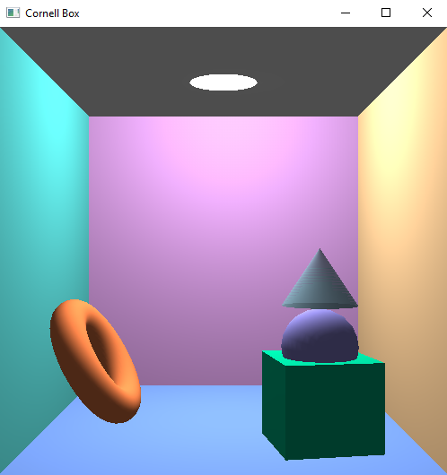

#Cornell Box PyOpenGL
This project is meant to propose the simplest implementation of Cornell Box using PyOpenGL. The following actions were performed to get close to photorealistic effect:
* the walls were drawn by dividing quads intoa lot of smaller quads to get smooth shadow.
* lamp was immitated by drawing a white circle on the ceiling and placing 4 spot sources of light right below it.
* I tried to make a "glass" cone by making a half-transparent cone of greenish color.

